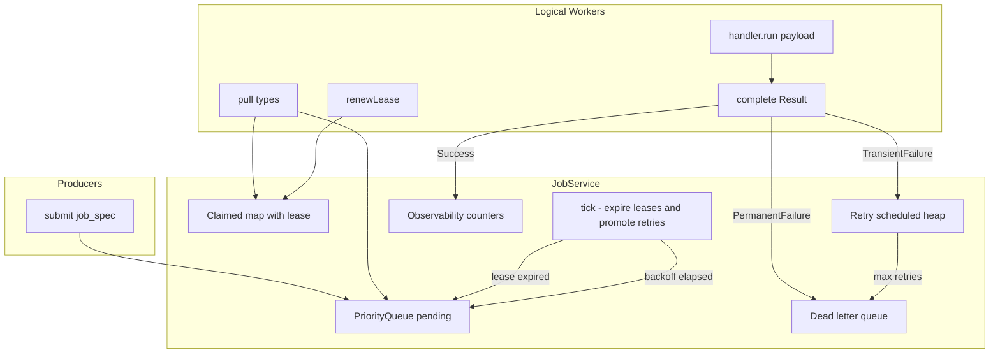

# In-Process Background Job Service — Design Plan

## 1. Problem Statement

Build an in-process Background Job Service. Producers submit jobs; workers pull jobs and execute them. The service guarantees at-least-once execution, retries failed jobs with backoff, surfaces stuck jobs, and exposes observability into queue health.

Think of it as a minimal Sidekiq / Celery / SQS-with-workers, all in one process for the purpose of this exercise.

---

## 2. Functional Requirements

### 2.1 Submit a Job

**API:** `submit(job_spec) -> job_id`

| Field | Type | Default | Notes |
|-------|------|---------|-------|
| `type` | string | required | Job kind, e.g. `"send_email"`, `"resize_image"` |
| `payload` | object | required | Opaque data passed to the handler |
| `priority` | int 0–9 | 5 | Higher executes earlier |
| `max_retries` | int | 3 | Retries after transient failure before DLQ |
| `lease_duration_ms` | int | 30000 | Optional override; see §4.1 |

**Behavior:**
- Validate inputs (priority in range, non-empty type, `max_retries >= 0`).
- Assign a monotonic `job_id` and `sequence_number` (for FIFO tie-breaking).
- Enqueue job in `pending` state.
- Return `job_id` to the producer.

### 2.2 Worker Model

Workers register with a list of `types` they can handle.

| Operation | Behavior |
|-----------|----------|
| `registerWorker(worker_id, types)` | Register a logical worker and its supported job types |
| `pull(worker_id, types) -> optional<LeasedJob>` | Acquire a lease on the highest-priority matching pending job |
| `renewLease(job_id, worker_id) -> bool` | Extend lease expiry for long-running jobs |
| `complete(job_id, worker_id, Result)` | Commit execution outcome |

**Lease semantics:**
- While a job is leased (`claimed`), no other worker can pick it up.
- Workers must renew the lease for long-running jobs.
- If the lease expires without renewal (worker crash, slow handler), `tick()` returns the job to `pending` for another worker.

### 2.3 Job Lifecycle — State Machine

```
pending ──pull/lease──► claimed ──success──► succeeded (terminal)
                            │
                            ├── transient fail──► retry_scheduled ──backoff elapsed──► pending
                            ├── permanent fail──► dlq (terminal)
                            └── lease expiry (tick)──► pending

retry_scheduled ──max retries exhausted on fail──► dlq (terminal)
```

| State | Meaning |
|-------|---------|
| `pending` | Available for a worker to pull |
| `claimed` | Leased to a worker; in-flight |
| `retry_scheduled` | Waiting for backoff delay before re-entering pending |
| `succeeded` | Terminal; job completed successfully |
| `dlq` | Terminal; moved to Dead Letter Queue |

### 2.4 Retry Policy

- **TransientFailure:** schedule retry with exponential backoff.
- **PermanentFailure:** skip retries; move directly to DLQ.
- After `max_retries` exhausted, move to DLQ.

**Backoff formula:**

```
delay_ms = min(1000 * 2^attempt, 300000)
```

Where `attempt` is the 1-based failure count (1st retry waits 2s, 2nd 4s, 3rd 8s, … capped at 5 minutes).

With default `max_retries = 3`, a job may execute up to **4 times** (initial attempt + 3 retries) before DLQ.

### 2.5 Job Execution — JobHandler Interface

Workers invoke handlers via a `JobHandler` interface:

```cpp
class JobHandler {
public:
    virtual ~JobHandler() = default;
    virtual Result run(const Payload& payload) = 0;
};
```

**Result variants:**

| Result | Action |
|--------|--------|
| `Success` | Mark job `succeeded` |
| `TransientFailure` | Schedule retry with backoff (or DLQ if retries exhausted) |
| `PermanentFailure` | Move immediately to DLQ |

Handlers are registered per job type: `registerHandler(type, handler)`.

### 2.6 Observability API

| Method | Returns |
|--------|---------|
| `pendingCountsByTypeAndPriority()` | Pending count grouped by type and priority |
| `inFlightCount()` | Number of currently leased (claimed) jobs |
| `dlqSize()` | Dead letter queue size |
| `listDlq()` | DLQ entries with job metadata, failure reason, attempt count |
| `workerStats(worker_id)` | Current lease (if any), success count, failure count |

**Stuck jobs:** A job is considered stuck when it remains in `claimed` state past its lease expiry without renewal. `tick()` surfaces this by expiring the lease and returning the job to `pending`. Observability can additionally report jobs nearing lease expiry (future extension).

### 2.7 Required Tests

| Test | Validates |
|------|-----------|
| At-least-once on worker crash | Lease expiry returns job to pending; another worker can claim it |
| Retry with backoff | Transient failures respect delay before re-queue |
| Lease renewal happy path | Renewed lease prevents premature re-claim |
| Priority ordering | Higher priority dequeued first |
| DLQ on max retries | Job moves to DLQ after retries exhausted |
| Permanent failure short-circuit | No retry; immediate DLQ |
| Observability | Counts reflect actual queue state |

---

## 3. Architecture

### 3.1 High-Level Flow



### 3.2 Concurrency Model

**Decision:** Single-threaded event loop with injectable clock.

- No OS worker threads in the MVP.
- All state mutation happens on one thread.
- Time advances via `IClock`; `JobService::tick(now)` sweeps expired leases and promotes retry-scheduled jobs.
- Tests use `FakeClock` to advance time deterministically without sleeps.

**Tradeoff:** Simpler correctness reasoning and testability vs. no real parallel execution. The lease/retry/DLQ logic is identical to what a multi-threaded version would use; adding a mutex wrapper later is straightforward.

### 3.3 Project Structure

```
PLAN.md
include/
  types.h           JobSpec, Job, JobState, Result, JobId, errors
  handler.h         JobHandler interface
  clock.h           IClock, SystemClock, FakeClock
  job_service.h     JobService public API
src/
  job_service.cpp   queue, lease, retry, DLQ, observability
tests/
  job_service_test.cpp   lightweight assert-based tests
main.cpp            optional demo
```

### 3.4 Core Entities

| Entity | Responsibility |
|--------|----------------|
| `JobSpec` | Input from producer; validated on submit |
| `Job` | Internal record with id, state, lease info, attempt count |
| `JobService` | Queue management, leasing, retry, DLQ, observability |
| `JobHandler` | Pluggable execution logic per job type |
| `IClock` | Abstract time source for testability |
| `Worker` | Logical identity registered with supported types |

### 3.5 Internal Storage

| Structure | Purpose | Implementation |
|-----------|---------|----------------|
| Pending queue | Jobs ready to pull | Max-heap: priority desc, sequence asc |
| Claimed map | In-flight jobs with leases | `unordered_map<JobId, ClaimedJob>` |
| Retry heap | Jobs waiting for backoff | Min-heap on `retry_at` timestamp |
| DLQ | Terminal failures | `vector<DlqEntry>` append-only |
| Handler registry | Type → handler mapping | `unordered_map<string, JobHandler*>` |
| Worker registry | Worker id → types, stats | `unordered_map<string, WorkerInfo>` |

---

## 4. Resolved Ambiguous Behaviors

### 4.1 Lease Duration

| Aspect | Decision |
|--------|----------|
| Default | **30 seconds** (30000 ms) |
| Override | Optional `lease_duration_ms` on `JobSpec`, clamped to `[1000, 300000]` |
| Per job type | **Not in MVP** — no type-level config table |

**Why 30s default:** Long enough for typical handlers in a demo/interview setting; short enough to test expiry quickly with a fake clock.

**Why submission-time override only:** One optional field covers long-running jobs without a separate configuration layer. Per-type defaults can be added later without changing the API.

**Tradeoffs:**

| Approach | Pros | Cons |
|----------|------|------|
| Fixed global default (chosen) | Simple; predictable | May be wrong for some job types |
| Per-type config | Tailored to handler behavior | Extra config surface; registry complexity |
| Per-submission override (chosen, additive) | Flexible for outliers | Caller must know duration |

### 4.2 Lease Semantics on Overrun

**Scenario:** Worker A claims a job. Lease expires. Worker B claims the same job. Worker A finishes and calls `complete(Success)`.

| Aspect | Decision |
|--------|----------|
| Completion gate | `complete()` requires matching `(worker_id, lease_generation)` |
| Stale completion | Returns `LeaseLost`; result is **discarded**, change state to pending |
| Execution | Both A and B **may execute** the handler |
| Commit | Only the holder of the **current valid lease** may commit outcome |

**Why reject stale commits:** Matches SQS visibility-timeout semantics. Accepting Worker A's late success would mark a job succeeded that Worker B may still be processing — corrupting terminal state.

**At-least-once implication:** Duplicate handler invocations are possible and expected. Handlers must be idempotent (see §4.5).

**Tradeoffs:**

| Approach | Pros | Cons |
|----------|------|------|
| Reject stale complete (chosen) | Safe terminal state; no false success | Duplicate side effects from double execution |
| Accept first complete wins | Fewer wasted executions | Race conditions; ambiguous terminal state |
| Accept last complete wins | Simple API | Late failure can overwrite success |

### 4.3 Priority Semantics

| Aspect | Decision |
|--------|----------|
| Model | **Strict priority** — priority 9 always before 8, regardless of wait time |
| Guarantee | Among jobs a worker can handle, highest-priority pending job is returned first |
| Starvation | Low-priority jobs **may starve** under sustained high-priority load |

**Why strict:** Simplest correct implementation (single priority heap); easiest to test and reason about.

**Tradeoffs:**

| Approach | Pros | Cons |
|----------|------|------|
| Strict priority (chosen) | Predictable; O(log n) dequeue | Starvation of low priority |
| Weighted fair queuing | Bandwidth share across priorities | Complex; harder to test; ambiguous guarantees |
| Aging / priority boost | Prevents starvation | Non-deterministic ordering; more state |

### 4.4 Same-Priority Ordering

| Aspect | Decision |
|--------|----------|
| Ordering | **FIFO** within the same priority level |
| Mechanism | Monotonic `sequence_number` assigned at submit time; lower sequence wins ties |

**Why FIFO:** Predictable and fair within a priority band. Standard for job queues (Sidekiq, Celery default behavior).

**Alternatives considered:** LIFO (better cache locality but unfair); unspecified (harder to test and debug).

### 4.5 At-Least-Once vs At-Most-Once

| Aspect | Decision |
|--------|----------|
| Delivery guarantee | **At-least-once** — a job may be executed multiple times |
| Outcome commit | **At-most-once** — via lease generation check, only one completion is accepted |
| Handler contract | Handlers **must be idempotent** or use external deduplication |
| Service dedup | **Not in MVP** — no idempotency store |
| Convention | Document optional `payload["idempotency_key"]` for handler-side dedup |

**When duplicate execution occurs:**
1. Lease expires before `complete()` — another worker re-claims.
2. Worker crashes after handler runs but before `complete()`.
3. Transient failure triggers retry — handler runs again after backoff.

**Guidance for handler authors:**
- Use idempotent operations (e.g., `UPSERT` instead of `INSERT`).
- Store an idempotency key in the payload; check before performing side effects.
- Design handlers so repeated execution produces the same observable outcome.

**Tradeoffs:**

| Approach | Pros | Cons |
|----------|------|------|
| At-least-once + idempotent handlers (chosen) | Simple service; industry standard (SQS, Kafka) | Burden on handler author |
| Exactly-once execution | No duplicate side effects | Requires distributed transactions or dedup store; out of scope |
| At-most-once (drop on lease loss) | No duplicates | Jobs can be lost silently |

---

## 5. Public API Summary

```cpp
class JobService {
public:
    explicit JobService(IClock& clock);

    JobId submit(const JobSpec& spec);
    void registerWorker(const std::string& worker_id, const std::vector<std::string>& types);
    void registerHandler(const std::string& type, JobHandler* handler);

    std::optional<LeasedJob> pull(const std::string& worker_id,
                                  const std::vector<std::string>& types);
    bool renewLease(const JobId& job_id, const std::string& worker_id);
    CompleteStatus complete(const JobId& job_id, const std::string& worker_id, Result result);

    void tick();  // uses clock.now(); expires leases, promotes retries

    // Observability
    std::map<std::string, std::map<int, int>> pendingCountsByTypeAndPriority() const;
    int inFlightCount() const;
    int dlqSize() const;
    std::vector<DlqEntry> listDlq() const;
    WorkerStats workerStats(const std::string& worker_id) const;
};
```

### Worker Usage Pattern

```cpp
FakeClock clock;
JobService svc(clock);
svc.registerWorker("w1", {"send_email"});
svc.registerHandler("send_email", &emailHandler);

// Producer
svc.submit({"send_email", {{"to", "a@b.com"}}, /*priority=*/7});

// Worker loop
svc.tick();
if (auto job = svc.pull("w1", {"send_email"})) {
    Result r = emailHandler.run(job->payload);
    svc.complete(job->id, "w1", r);
}

// Long-running job: renew before expiry
svc.renewLease(job_id, "w1");

// Simulate time passing
clock.advance(std::chrono::seconds(30));
svc.tick();  // lease sweep
```

---

## 6. Design Patterns

| Pattern | Where | Why |
|---------|-------|-----|
| Strategy | `JobHandler` per job type | Swap execution logic without changing `JobService` |
| Registry | Handler and worker maps | Decouple registration from execution |
| Dependency Injection | `IClock` injected into `JobService` | Testable time without sleeps |
| State machine | Job lifecycle transitions | Explicit, auditable state changes |

---

## 7. Complexity Analysis

| Operation | Time | Space |
|-----------|------|-------|
| `submit` | O(log n) heap push | O(1) per job |
| `pull` | O(log n) pop; may re-push non-matching types | O(1) |
| `complete` | O(log n) if scheduling retry | O(1) |
| `renewLease` | O(1) map lookup | O(1) |
| `tick` | O(k log n) for k expired leases / due retries | O(1) |
| Observability queries | O(n) scan or maintained counters | O(n) total for n jobs |

**Pull optimization note:** If type filtering causes many re-pushes, per-type priority heaps can reduce scan cost. Acceptable for MVP with moderate queue depth.

---

## 8. Test Plan

Lightweight assert-based runner in `tests/job_service_test.cpp` — no external test framework.

```cpp
void expect(bool condition, const char* message);
// main() returns non-zero on any failure
```

| Test | Setup | Assertion |
|------|-------|-----------|
| `test_priority_ordering` | Submit priorities 0, 9, 5 | Pull order: 9, 5, 0 |
| `test_same_priority_fifo` | Submit three jobs at priority 5 | Pull order matches submit order |
| `test_lease_renewal_happy_path` | Claim, renew, advance clock partially, complete | Job succeeds; not re-available |
| `test_lease_expiry_at_least_once` | A claims, no renew, tick past expiry; B claims and completes; A calls complete late | B succeeds; A gets `LeaseLost` |
| `test_transient_retry_backoff` | Handler returns TransientFailure | Job in retry_scheduled; not pullable until backoff elapses |
| `test_max_retries_to_dlq` | Handler always fails transiently, max_retries=3 | After 4 attempts, job in DLQ |
| `test_permanent_failure_short_circuit` | Handler returns PermanentFailure on first attempt | Immediate DLQ; attempt count = 1 |
| `test_observability` | Submit, claim, complete, fail to DLQ | All counters match expected values |

Mock handlers: small structs with configurable `Result` return and invocation counters.

---

## 9. Implementation Order

1. `include/types.h`, `include/clock.h`, `include/handler.h` — core types and clock abstraction
2. `JobService` — submit, pull, complete (success path), priority queue
3. `tick()` — lease expiry and retry promotion
4. Retry + DLQ — transient and permanent failure paths
5. `renewLease()` + stale complete rejection via lease generation
6. Observability APIs and worker stats
7. `tests/job_service_test.cpp` — all scenarios above
8. `main.cpp` — optional end-to-end demo
9. Update `tasks.json` build config

---

## 10. Future Extensions (Out of Scope for MVP)

| Extension | Benefit |
|-----------|---------|
| Per-job-type default lease and retry config | Tailored defaults without per-submit overrides |
| Weighted priority / fair queuing | Prevent low-priority starvation |
| Jitter on backoff (`delay * random(0.5, 1.5)`) | Reduce thundering herd on retry |
| Idempotency store keyed on `idempotency_key` | Service-level exactly-once side effects |
| Multi-threaded workers with mutex | Real concurrent pull/execute |
| Stuck-job alert API | Report jobs past N renewals or M lease cycles |
| Job cancellation | Allow producer to cancel pending jobs |
| Persistent storage | Survive process restarts |

---

## 11. Assumptions

1. Single process; no network partition between service and workers.
2. `payload` is an in-memory map (`std::map<std::string, std::string>`); serialization is out of scope.
3. Job IDs are unique strings generated internally (e.g., monotonic counter or UUID).
4. Workers are cooperative — they call `pull`, `renewLease`, and `complete` explicitly (no background threads spawned by the service).
5. Clock is monotonic within a test run; no leap-backward handling needed for MVP.
6. Handler execution time is not bounded by the service; workers are responsible for renewing leases.
